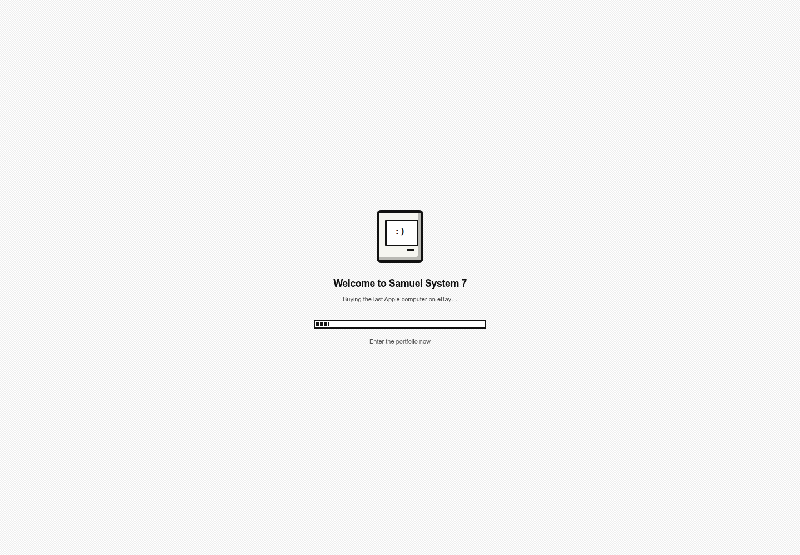
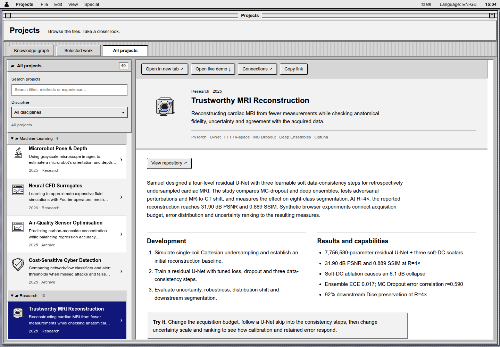
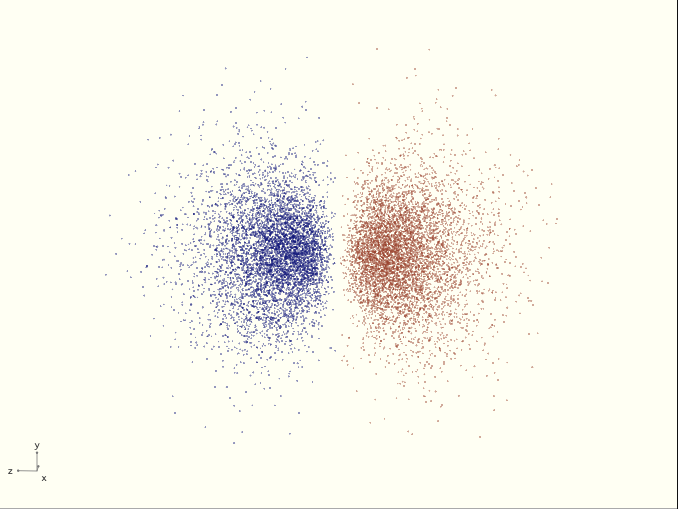
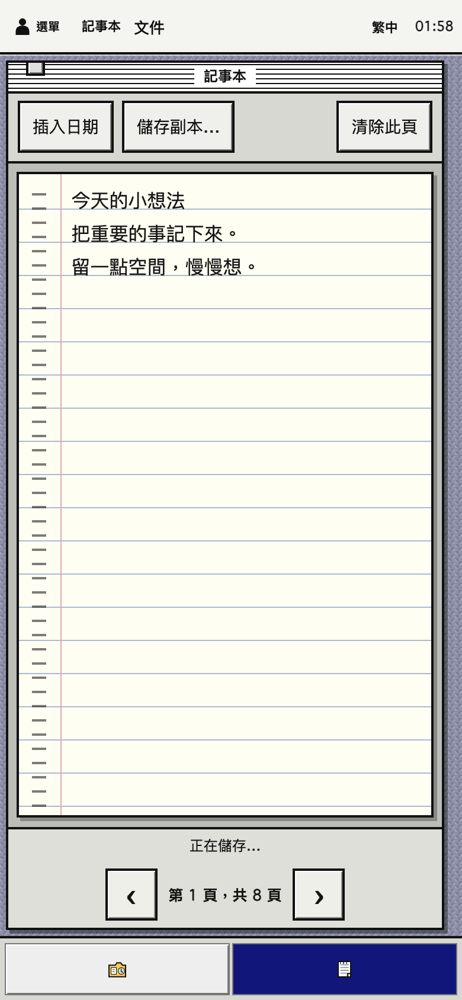
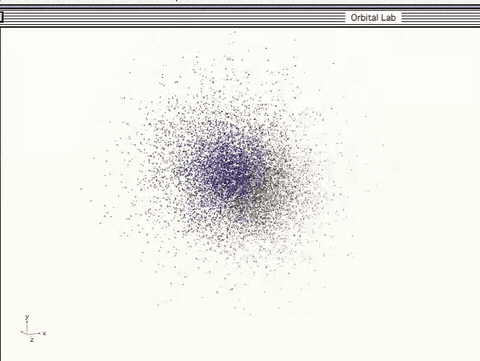

# Samuel System 7

### A personal website with a desktop's curiosity.

Samuel Zhang's personal portfolio, presented as a carefully researched
System 7-inspired desktop. Biography, experience, projects, COVERD, games, CVs
and supporting documents open as movable desktop windows inside one browser
tab—without an account, tracking API or server-side personal-data store.

**[Open the live desktop](https://me.samuelzhang.co.uk)** ·
**[Browse the project archive](https://me.samuelzhang.co.uk/projects)** ·
**[Explore Orbital Lab](https://me.samuelzhang.co.uk/orbitals)**

**40 project files · 9 useful desk apps · 4 languages · no account required**

[Tour](#a-quick-look) · [Apps](#the-desk-apps) · [Run locally](#local-development-on-port-5174) · [Deploy](#docker-deployment) · [Verification](#validation) · [Publication & licensing](#publication-and-licensing)

Current implementation and review: [documentation index](docs/README.md). Historical audits are kept in [the archive](docs/archive/README.md); their counts describe their original checkpoints.



## A quick look

A familiar title bar. A useful little notebook. An orbital you can turn in your
hands. The old desktop language is the starting point; the interactions are
built for today's browsers, keyboards and touch screens.



<table>
  <tr>
    <th>Probability, made visible</th>
    <th>The same desk, in your pocket</th>
  </tr>
  <tr>
    <td></td>
    <td></td>
  </tr>
</table>

<details>
<summary>Watch Orbital Lab turn — animated preview</summary>



The GIF is a compact recording, not a performance benchmark. The application
uses display-timed animation, starts paused, and respects reduced-motion settings.

</details>

The desktop and project-browser images show the latest local refinement; the orbital and Note Pad images retain their earlier capture dates. The deployed site may remain on an earlier revision until the server owner runs the deployment script.

## The desk apps

Every app has its own archive record; the records launch the same desktop windows.

| App | What it is good for | Keep the result |
| --- | --- | --- |
| Note Pad | Eight ruled pages, date insertion and clear page navigation | Local autosave, text export and desk backup |
| Sketch Pad | Quick mouse/touch drawings with undo | Local drawing, PNG and desk backup |
| Quick List | Small tasks, priorities and completion | Local autosave and desk backup |
| Focus Clock | Timed focus sessions and a daily tally | Local progress and desk backup |
| Pocket Calendar | Private notes attached to dates | Local autosave and desk backup |
| Desk Calculator | Everyday arithmetic with a paper tape | Copy result, local tape and desk backup |
| Unit Converter | Length, mass, temperature and decimal data units | Copy result |
| Colour Studio | Palette swatches and contrast checks | Local swatches and desk backup |
| Orbital Lab | ASCII, probability points and smooth orbital surfaces | Text/PNG exports with model context |

Local means this browser profile—not a cloud account, shared database or promise
of permanent storage. Export a backup before clearing site data or changing devices.

## What is included

- Four routed locales: British English, American English, Simplified Chinese and Traditional Chinese.
- A language selector with locale persistence and mobile-safe menus.
- One Documents app with localised Applied AI CVs and continuously scrolling reviewed PDF previews.
- Eight browser-local desk accessories: Note Pad, Sketch Pad, Quick List, Focus Clock, Pocket Calendar, Calculator, Unit Converter and Colour Studio, with autosave plus portable backup and restore.
- A classic Find window (`⌘K` / `Ctrl+K`, or **File → Find…**) searches all 22 apps and 40 project files. Optional Detailed search includes public project/demo text with matching excerpts; arrow keys choose a result, Return opens it and Escape closes Find.
- A browser-native Orbital Lab: all 118 elements, real s/p/d/f orbital clouds in high-DPI ASCII, density points or smooth 3D, refresh-synchronised rotation, subshell inspection, radial curves, node counts and exports.
- Shared System 7 pop-up menus throughout accessories, project filters and interactive labs, with keyboard/typeahead navigation and bounded touch-friendly lists.
- Three persistent desktop patterns and a menu-bar clock that opens Pocket Calendar with one click.
- A 40-record project archive organised into six guided shelves and 16 experiences: 27 lazy-loaded interactive chapters plus nine entries launching the existing Orbital Lab and desk apps, five reviewed external-or-artifact actions, an expert file catalogue and a source-derived portfolio map.
- Built-in PDF previews, seven local-only profile, decision and science games, plus desktop easter eggs.
- A full RUN/HACK cabinet exhibit covering Samuel’s second-place SideQuest build, with an interactive Strava evidence reader, subsequent-run sandbox, challenge loop and privacy-safe live-room replay.
- Keyboard focus states, reduced-motion support and small-screen guidance.
- Responsive System 7 windows designed for 320 px mobile screens through large desktops, with pointer- and keyboard-resizable floating windows on desktop.
- A localised Finder-style crash dialog for unknown routes that preserves the real HTTP 404 status and offers safe ways home.


The 9 September update adds direct career and education links, employer-aware project search and project context before launch. Demo URLs retain `&view=demo`. STUDY-RL now includes actual seeded CliffWalking Q-learning/SARSA, recorded small-model answer comparison, live LoRA updates and a DPO objective calculator. The source review records 25 executed notebooks, 448 lecture pages, 279 passing tests and one Week 25 failure.

New experiments include finance import identity, overlap replay, provider-ID corrections and reconciliation edge cases; scheduling across daylight-saving changes, backup failure sequences, MRI residual patterns and acquisition budgets, CFD rollout amplification, vision sequence splits, spectral matching order and coverage under population shift. Their controls label calculated teaching examples separately from recorded source results. MRI also exposes uncertainty rescaling, ranking and pixel-removal budgets against an equal-budget oracle. Saved CFD sequences support pinned-frame comparison; microscopy supports pose/depth Grad-CAM comparison on the same source image. MRI also offers a recorded reconstruction figure from its pinned IX repository, separate from the synthetic interactive phantoms. Large scientific images load only in their selected view. CFD playback suspends its timer in hidden browser tabs; Snake and Brick Breaker pause and wait for Resume. `npm run check:learning` checks 148 source transition fixtures, control semantics, learning calculations, response evidence and career references before production builds. `npm run check:experiments` checks eight scientific/product interaction suites, seven original finance-source fixture attempts and 70 MRI scale/ranking/removal configurations with independent numerical expectations and control interactions. `npm run check:scientific-media` checks the archived media and playback/comparison controls.

## System 7 design contract

This is an interpretation for the modern web, not a claim of pixel-for-pixel
emulation. The interface follows the useful constraints in Apple's 1992
Macintosh guidance: consistency, direct manipulation, progressive disclosure,
clean black-and-white structure, and familiar visual metaphors.

- Chicago-first window/menu chrome, Geneva-first content and Monaco/Courier
  machine readouts, with language-appropriate CJK fallbacks.
- 32 × 32 desktop icon plates and 16 × 16 menu artwork.
- Slightly rounded push buttons, square pop-up menus, hard one-pixel relief,
  separate default-action and keyboard-focus rings, and restrained project
  colour. The [System 7 benchmark](docs/SYSTEM7_DESIGN_BENCHMARK.md) distinguishes
  the original Apple controls from modern readability and touch adaptations.
- Compact layouts keep the content and hierarchy but replace floating windows
  with one usable app surface, safe-area handling and coarse-pointer targets.

The detailed evidence, viewport matrix and known boundaries live in the
[release audit](docs/archive/RELEASE_AUDIT.md). The visual reference is the
[Macintosh Human Interface Guidelines (1992)](https://tecfa.unige.ch/tecfa/teaching/LME/lombard/HIGuidelines.pdf).

## Project archive

Small interactive evidence fixtures use reviewed local CSV files under
`src/data/project-fixtures/`. The relevant lazy chunk embeds them at build time;
third-party fetching and raw public downloads are disabled. `npm run check:data` pins their schema, size, row grain, domains,
uniqueness and SHA-256 before every production build.

The Projects folder opens in a **System 7 knowledge graph with a 3D view** connecting topics, methods, projects, experience and education. Select a node to traverse its relationships, open a project or its demo, or follow a dated career record. The graph contains a linked work and education timeline. Its expandable catalogue-analysis section preserves the earlier chronology, matrices, comparisons and model-lineage views. Focus, whole-graph, selection and fit changes ease the camera, node positions and opacity over 720 ms while preserving the viewing angle. An interrupted transition continues from the displayed state; reduced motion applies changes immediately. Animation frames stop when the transition ends. Raised System 7 controls and inset panels match the other archive views.

**Selected work** offers a short list of featured projects. **All projects** is a folder tree grouped by discipline, with a text filter and keyboard navigation. Press `/` while the archive is active to open that view and focus search. Enter or Down moves into its results. Detailed text is fetched only when someone searches; names, descriptions and tools still filter if that request fails.

Selecting a record updates the right-hand project document beside the searchable, filterable list. The problem, work, results and career/education context are immediately available. **Open live demo** loads the experiment on request; **Open in new tab** opens the complete document. **Connections** returns to that project's graph neighbourhood. On phones, **Back to list** restores the selected row and keyboard focus. Browser Back/Forward preserves the selection and search. The nine native-app records launch their existing desktop windows.

Project explanations focus on what the work does, why the method was chosen and how to explore it. Recorded measurements, illustrative calculations and their relevant limits remain distinguishable. Internal repository receipts, checkpoint reconciliation and file-by-file audit tables are developer material rather than visitor-facing project descriptions. GROWMAT opens the original linked showcase PDF.

The graph's **Compare projects** disclosure retains dates, discipline/access comparisons, technologies, project relationships and model-family views. A reading guide explains the comparison without exposing implementation files. The graph connects all 40 projects to subjects, methods and dated CV contexts. Focus transitions retain 3D depth and respect reduced motion; rotation, pan, zoom, a flat view and a keyboard-accessible node list remain available.

Descriptions, controls, feedback and accessible labels have explicit Simplified and Traditional Mandarin copy. Source code, software names, scientific notation, Italian lesson material and recorded English model/job/CV samples retain their necessary spelling; surrounding explanations are translated. All 118 element names are localized in both Mandarin editions, including accessible labels and orbital exports. See the [copy workflow](docs/PROJECT_COPY_WORKFLOW.md) and [current review](docs/WIDE_SWEEP_2026-09-09.md) for the tested scope and intentional source-language exceptions.

`npm run prepare:search` builds four deterministic text indexes from each project's metadata and own public component copy. Translation dictionaries are not indiscriminately indexed into unrelated projects. Private notes, drawings, imported statements, linked PDFs and external websites are excluded. Rebuild these indexes after changing copy in an already-running dev session. Generated JSON is ignored in Git and rebuilt for production; it is absent from initial JavaScript.

Project documents and controls share `src/app/system7.css`: white paper, named grey surface layers, crisp bevels, black boundaries, a consistent type scale, hard button shadows, an outer default-button ring and separate pressed/selected/focus states. The [historical benchmark](docs/SYSTEM7_DESIGN_BENCHMARK.md) distinguishes Apple-era references from modern touch/accessibility adaptations. Scientific series retain meaningful colour. Wide figures scroll inside their own frame instead of shrinking their labels to phone-sized illegibility.

Three generated project covers depict microrobot imaging, neural flow prediction and finance. Desktop, Finder, project, arcade and Home Lab pictograms share 39 editable SVG symbols and 11 transparent PNG variants. The [artwork guide](docs/PROJECT_ARTWORK.md) links generation prompts, delivered assets and the saved scientific-media sources.

Mathematical expressions across the project studios use the shared `MathEquation` component with KaTeX 0.18.7 and accessible MathML. Equations retain their source meaning and readable labels; code and pseudocode remain code. The renderer loads on demand, with local CSS and fonts and no CDN dependency. Wide equation panels and aligned long expressions preserve readable typesetting within the System 7 framing.

Disclosure is explicit:

- `Public demo` means a sanitised browser port is available.
- `Case study` means reviewed narrative or research evidence is available.
- `Private / redacted` means the live system, operational data, credentials and source remain withheld; any deliberately public artifact is reviewed and pinned separately.
- `Open source` is reserved for material with a clear public licence; public visibility alone is not treated as an open-source grant.

The Open source count intentionally remains zero: no archive record is presented as carrying an unrestricted open-source grant. This desktop's own code now has a custom non-commercial source-available licence, which is a different category. Nested licences belonging to dependencies or teaching infrastructure do not licence their parent repositories.

Private entries use labels, lock icons and patterns as well as colour. Insurance lead matching and other organisational work use synthetic or high-level public reconstructions. GROWMAT links its original external showcase by owner request; live company data, credentials and source remain private.

## RUN/HACK cabinet exhibit

The `/sidequest` route opens a first-class System 7 app about the 29 August 2026 Running Hackathon. It separates Samuel’s 5K race and the team’s additional 44K relay from the product evidence: the documented 209-run Strava source profile belongs to teammate Javiera Rubio. The exhibit shows only reviewed aggregate counts and a browser-local hypothetical-run sandbox; raw Strava activities and GPS coordinates are not published.

The Live room is an explicit interactive replay. It demonstrates the original camera/GPS, spectator-cheer and runner-controlled challenge flow without requesting camera, microphone or location permission from portfolio visitors. Links to the original SideQuest deployment and source remain external, and deployment availability is not guaranteed; the source repository has no declared licence, and ephemeral prototype video was not recorded.

Replay transport supports pause/resume, rewind and single-point stepping. It pauses when its chapter, demo or browser tab is hidden; reduced-motion visitors start in manual mode. Repeated cheers remain responsive without accumulating an unbounded event feed.

## Privacy boundaries

### Orbital Lab

Open its dedicated **Orbital Lab** desktop icon, `/orbitals`, the Apple menu
entry, or its Desk Accessories card. The desktop shortcut has its own orbital
artwork, translated label and description, and opens the standalone app window.
Start with H, C, Fe or Ce; choose an occupied subshell and real angular component,
then drag the view or use arrow keys/buttons to rotate it. Choose **ASCII**
(Fine or Ultra detail), **Density 3D** (transparent probability points with
adjustable opacity), or **Smooth 3D** (lit constant-density surfaces). Canvas
backing stores follow display pixel density, including mobile and browser zoom.
The collapsible periodic table sits above the viewer, supports keyboard selection,
and includes group/period labels and a block-colour key. The inspector adds shell
electron totals and aligned Hund-filling arrows. **Save ASCII…** exports text with
model notes and sources; the 3D modes offer **Save image…** for a PNG.

This is an analytic, non-relativistic, one-electron **hydrogen-like model at
Z = 1**, not a molecular solver or a calculation of the selected many-electron
atom. Neutral configurations through element 104 follow NIST reference
compilations; 105–118 are explicitly illustrative Aufbau fillings. Phase ink
denotes wavefunction sign, not charge. Clouds contain the inner 99.5% of radial
probability and are independently fitted to the viewport. The app explains
projection, thin-slab and radial-density limits instead of implying physical
boundaries or comparable atomic sizes. The smooth surface is a sampled 1%-of-peak
|ψ|² isovalue, not a fixed probability enclosure. Its adaptive spatial bound
resolves high-n cores; small features below the 80-cell grid can still be omitted.

The interface has all four locales, with separate Mandarin terminology for
Mainland China and Taiwan. Element names retain their English reference labels.
The bounded sampler and renderer make no runtime third-party calls and rotation
starts paused. Surface meshing runs in a same-origin worker with a three-entry
cache. 3D uses WebGL and falls back to ASCII if unavailable; no account, chemistry
package or extra subscription is needed.

### Other exhibits

Browser exhibits use deterministic, generated or clearly labelled synthetic inputs where private data or runnable source cannot be published. Source evidence, independently implemented reconstruction and illustrative behaviour are identified separately; demos make no live third-party calls or unsupported performance claims.

The Desk Accessories are deliberately device-local. Note pages, focus progress and calculator tape use versioned browser storage with no account, API or server database. They therefore work the same in local development and the read-only production container, but do not sync between browsers or devices.

Open tabs in the same browser receive saved-state updates. This is last-observed-save behaviour, not collaborative editing or conflict merging. Export a Desk Accessories backup to keep a portable copy; a validated restore asks before replacing the current accessory data. Calendar notes also require a second click to clear. Calendar navigation supports arrows, Home/End, Page Up/Down and Shift + Page Up/Down for years.

- Finance examples use invented transactions. Raw statements, databases, identifiers, holdings and upload APIs are not shipped.
- The CV demo uses sample text and deterministic browser-side matching. Personal applications and third-party model calls are excluded.
- Scheduling examples use fictional people and never connect to calendars, email or a database.
- The Parliamo exhibit uses disposable attempts and synthetic evidence. Private learner state, backups, course scans and class archives are excluded; only two anonymous generated workbooks are published.
- Scientific and decision demos use generated illustrations, fixed reviewed metrics or labelled toy calculations. They do not download weights or serve assessed datasets.
- Molecular-recognition and solubility exhibits use deterministic synthetic spectra, geometries, compounds and observations while linking only pinned public equations or primary conference evidence.
- Innovation and venture-reasoning exhibits re-author assessed ideas with fictional organisations and inputs; original submissions, prompts and prose are not served.
- The STUDY-RL atlas separates repository QA evidence from learner progress and keeps restricted applied work undisclosed.
- The chemistry, market-impact and home-lab exhibits publish independently implemented browser calculations and synthetic identifiers, not private course archives, source repositories or live infrastructure state.
- Curated project artifacts are hash-pinned; raw datasets, checkpoints, assessed solutions and notebooks containing local paths are excluded.

## Technology

- Next.js 15 App Router
- React 19 and TypeScript
- Hand-written CSS and SVG System 7 artwork
- Static generation for locale and application routes
- Standalone, non-root Docker runtime

## Publication and licensing

The original code is **source-available with attribution, non-commercial use and
free share-alike conditions**. The complete terms are in [LICENSE](LICENSE).
This is a custom licence—not an OSI-approved open-source licence or a Creative
Commons software licence. A restriction on commercial use does not meet the
[Open Source Definition](https://opensource.org/osd).

| You may | You must | You may not |
| --- | --- | --- |
| Study, modify and share the original code for non-commercial purposes | Credit Samuel Zhang and link to this repository | Sell copies/templates, charge for access, or monetise the work |
| Build a free personal portfolio, including one used to seek employment | Put visible attribution in About, Credits or a footer | Use it for paid client work or a commercial product/service |
| Publish a modified version | Keep it free, under the same licence, with its editable source available | Remove attribution or impose restrictions preventing further permitted sharing |

Example credit:

> Inspired by [Samuel Zhang](https://github.com/samuel-zhang01/samuel-homepage).

These permissions cover only rights Samuel can grant. Personal/CV content,
photographs, corporate and educational documents, brands and separately attributed
third-party material are **not** a reusable portfolio-content pack. Replace them
with your own authorised content. Dependencies and attributed material retain
their own terms; see [Third-party notices](THIRD_PARTY_NOTICES.md). This is not an
Apple product and is not affiliated with or endorsed by Apple.

**Publication status, 5 September 2026:** GitHub reports this repository is already
public. The current website's artifact gates are not a privacy clearance for all
Git history, nor do they establish redistribution rights for every portfolio
asset. Historical-content and media-permission review remains open; no visibility
change or history rewrite was performed. Do not describe the repository as fully
cleared for unrestricted redistribution. The custom licence expresses the owner's
requested terms; obtain qualified legal review before relying on its enforceability.

### Make a personal version

1. Read the licence and preserve the credit, licence and third-party notices.
2. Download the source using GitHub's **Code → Download ZIP**, or clone it.
3. Replace biography, contacts, CVs, photos, employer/client information and
   project records with material you own or have permission to publish.
4. Update the canonical hostname and host allowlist before deploying elsewhere;
   this checkout intentionally verifies Samuel's production domain.
5. Update the reviewed-artifact hashes and locale fixtures for your own approved
   files. Do not disable the privacy gates to make a build pass.
6. Run the complete release checks, publish the editable source of your changes
   with the same licence, and retain a visible linked attribution.

## Local development on port 5174

Node.js 20.16 or newer is required.

```bash
npm ci
npm run dev:lan
```

- This machine: `http://localhost:5174`
- LAN: `http://<machine-ip>:5174`
- Project archive: `http://localhost:5174/projects`
- LAN project archive: `http://<machine-ip>:5174/projects`

`dev:lan` binds the development server to `0.0.0.0`, so use it only on a trusted network. Host firewall rules still apply.

For the default loopback-only Next.js development server, use `npm run dev` and open `http://localhost:3000`.

### VS Code quick loop

Run **Tasks: Run Task** from the Command Palette, then choose **Homepage: dev preview**. The task keeps the Next.js server in a dedicated terminal and hot-reloads edits at `http://localhost:3000`; `/desk` opens the productivity-app launcher directly. **Homepage: validate release** is the default build task for a full lint, dependency and isolated-production check.

## Validation

Before publishing, run:

```bash
npm run check:release
```

This includes deployment-script simulations, search checks, dependency auditing
and signature verification, lint, TypeScript checking and an isolated production
build. The build also runs the artifact, data, desk, control, orbital, catalogue,
style, locale and output-budget gates. No production server is changed by this
command. You can run each `check:*` script separately while working.

`npm run build` runs all portfolio gates automatically. The artifact gate rejects unexpected files and verifies reviewed assets by size, signature and SHA-256; the local-data gate pins the reviewed CSV schema and bytes; the desk-behaviour gate covers timer rollover and numeric-entry regressions against the actual shared helpers; the catalogue gate checks unique routes/demos, disclosure rules, source-licence status, local artifact paths and HTTPS references; the CSS-module gate verifies that every static project style reference resolves; and the locale gate keeps archive schemas aligned while preventing untranslated System 7 chrome, project summaries or suite descriptions from silently shipping.

`npm run check:math` validates actual expressions with the strict KaTeX parser, accessible component output and local font assets. The output gate caps the shared math-renderer chunk at 300 KiB and rejects its inclusion in initial page entries. Initial-route JavaScript has a 270 KiB gzip ceiling. The aggregate lazy browser/runtime ceiling is 5 MiB excluding math, increased from 4 MiB for the explicit bilingual project dictionaries; this is separate from initial page cost. KaTeX uses 20 local WOFF2 fonts (253.7 KiB) and 30.6 KiB of CSS.

Current measurements and the completed browser/check matrix are recorded in the [System 7 review](docs/archive/SYSTEM7_REVIEW_2026-09-09.md). The earlier restoration report describes its own prior build, not the final redesign bundle.

When a development server is already using `.next`, run `npm run build:isolated` instead. It writes the production checkpoint to `.next-build` so the live development cache is not replaced.

## Docker deployment

Compose binds the production container to `0.0.0.0:5174` by default. This makes the app reachable from the trusted LAN and lets the HTTPS proxy reach it. Override the host port with `HOMEPAGE_PORT=<port>` or bind only the server's LAN interface with `HOMEPAGE_BIND_ADDRESS=<server-lan-ip>`.

```bash
./deploy.sh
```

The one-command script works from any working directory. It requires Git,
Node.js 20.16+, npm, and a running Docker daemon with either `docker compose`
or legacy `docker-compose`. It refuses dirty checkouts (including untracked
files), requires `main`, fetches `origin/main`, and only fast-forwards; local
commits are never reset or discarded. The ignored server `.env` is preserved.
It then re-executes the updated script, installs locked dependencies with
`npm ci --include=dev`, runs the audits and behavioural checks, builds the image,
and verifies routes (including Orbital Lab in all four languages) and security
headers. Failed post-start verification restores the previous image; a failed
first deployment removes only its failed service container. A failed build
leaves the running container untouched. Image rollback does not revert the Git
checkout or dependencies.

To obtain this updated script on an older server checkout, first run
`git pull --ff-only`, then `./deploy.sh`. Future deployments need only
`./deploy.sh`. For a deliberately selected, clean revision without a fetch,
use `./deploy.sh --local`. Nothing pushes server changes back to GitHub.

`npm run check:deploy` exercises the startup, safe-update, failure and rollback
paths with real temporary Git repositories and simulated Docker/npm commands;
it does not start containers or contact the production server.

Basic manual container commands (without the script's verification/rollback):

```bash
docker compose up -d --build
docker compose logs -f samuel-homepage
```

The runtime container is read-only, runs as an unprivileged user, drops Linux capabilities and uses `no-new-privileges`. Use a reverse proxy with TLS for public deployment.

The pinned container base and native Next.js dependencies include `linux/arm64` support for a 64-bit Raspberry Pi OS. The current image does not target 32-bit `arm/v7`. Because the site is stateless on the server, the same image can sit behind a multi-node reverse proxy without shared application storage; Desk Accessory data remains in each visitor’s browser profile.

### Canonical HTTPS route

`https://me.samuelzhang.co.uk` is the production identity. Copy [`deploy.env.example`](deploy.env.example) to a private, ignored `.env` file on the deployment server, then run `./deploy.sh`. The script verifies that the container accepts the canonical host header; add `VERIFY_PUBLIC_ORIGIN=1` once DNS and the proxy are configured to also verify the external HTTPS response.

Configure the existing TLS reverse proxy / Nginx Proxy Manager host as follows:

- Domain: `me.samuelzhang.co.uk`
- Scheme: `http`
- Forward host: the deployment server's LAN address
- Forward port: `5174`
- Preserve the original `Host` header; enable force-HTTPS and a valid certificate.
- Do not use Cloudflare Flexible TLS. Use Full (strict) TLS or an equivalent end-to-end certificate configuration.

The application accepts only the canonical hostname, loopback health checks and RFC1918 LAN hosts in production. It sends CSP, no-sniff, same-origin isolation, permissions policy and HTTPS HSTS headers; the proxy remains responsible for TLS termination, certificate renewal, HTTP-to-HTTPS redirects and firewall exposure.

## Browser support

The full desktop targets current Chrome, Edge and Firefox releases and Safari 16.4 or newer. Mobile Safari and Chromium-based mobile browsers receive the same content in a small-screen window layout with safe-area handling.

Internet Explorer is not supported by Next.js 15. IE 10/11 receive a small server-rendered fallback with direct CV and email access; the full experience requires a modern JavaScript, CSS Grid and ES2019-capable browser.

## Relevant structure

```text
src/
├── app/
│   ├── [locale]/
│   ├── page.tsx
│   └── projects/page.tsx
├── components/
│   ├── PdfPreview.tsx
│   ├── DesktopFinder.tsx
│   ├── OrbitalLab.tsx
│   ├── OrbitalSurfaceCanvas.tsx
│   ├── ProductivityApps.tsx
│   ├── ProductivityExtras.tsx
│   ├── SideQuestCabinetApp.tsx
│   ├── SystemSevenDesktop.tsx
│   └── projects/
│       ├── DemoChrome.tsx
│       ├── ProjectDemoRouter.tsx
│       ├── ProjectExplorer.tsx
│       ├── ProjectCaseBrief.tsx
│       ├── projectStories.ts
│       ├── projectSuites.ts
│       ├── PortfolioMap.tsx
│       ├── PortfolioMap.module.css
│       ├── ModelLineageMap.tsx
│       ├── ModelLineageMap.module.css
│       ├── ProjectDocument.tsx
│       ├── ProjectArtwork.tsx
│       ├── KnowledgeGraph.tsx
│       ├── projectArchiveI18n.ts
│       ├── CvKeywordStudio.tsx
│       ├── SchedulingStudio.tsx
│       ├── InsuranceMatchingDemo.tsx
│       ├── ItalianLearningStudio.tsx
│       ├── FinanceStudio.tsx
│       ├── CourseRecommenderStudio.tsx
│       ├── MriTrustStudio.tsx
│       ├── CfdArchitectureStudio.tsx
│       ├── CfdShowcase.tsx
│       ├── DeferralRiskStudio.tsx
│       ├── SpectroscopyStudio.tsx
│       ├── ThermodynamicsStudio.tsx
│       ├── EnvironmentPlannerStudio.tsx
│       ├── ModelArchitectureStudio.tsx
│       ├── MicrorobotShowcase.tsx
│       ├── ChemistryCodingStudio.tsx
│       ├── HomeLabTopologyStudio.tsx
│       ├── StockMarketStudio.tsx
│       ├── InnovationModelsStudio.tsx
│       ├── VentureReasoningStudio.tsx
│       ├── MolecularRecognitionStudio.tsx
│       ├── DrugSolubilityStudio.tsx
│       ├── BanditStudio.tsx
│       ├── DecisionDemos.tsx
│       ├── ScientificDemos.tsx
│       └── RlAtlasDemo.tsx
├── data/projects.ts
└── lib/
    ├── i18n.ts
    ├── projectSearch.ts
    ├── orbitals.ts
    ├── orbitalAnimation.ts
    └── orbitalWebgl.ts

scripts/
├── prepare-project-search.mjs
├── prepare-pdfjs-assets.mjs
├── check-project-search.mjs
└── check-deploy.mjs

docs/                 # Technical audits and README media
LICENSE               # Original-code reuse conditions
THIRD_PARTY_NOTICES.md # Dependency and content boundaries

public/projects/
├── neural-cfd-surrogates/
├── parliamo/
└── study-rl/
```

Private research, raw bank statements and non-public authoring material are not
part of the deployed archive. This deployment boundary does not erase historical
Git objects; the publication review above is a separate responsibility.
